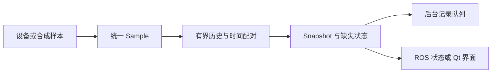

# Multisensor Acquisition Studio

C++17 multisensor acquisition with timestamp matching, bounded recording, ROS 1 adapters and Qt thread ownership.

**多源采集 · 时间关联 · 有界队列 · ROS 1 · Qt**

依据实际项目处理流程重新组织的公开展示代码，侧重算法核心、数据契约与软件结构。原始工程未直接上传；示例使用合成数据和通用接口。展示版不是原系统完整复现，也不附带原系统性能指标。

## 能看到什么

| 模块 | 内容 |
|---|---|
| 时间关联 | 按采样时间维护有界历史，最近邻配对、最大偏差检查与显式缺失状态 |
| 并发核心 | 互斥保护复合状态，条件变量等待，有界入队与停止排空 |
| 异步记录 | 独立线程保存 CSV 元数据，拒收计数与写盘错误状态 |
| 字节流解析 | 新示例协议支持半帧、多帧、噪声恢复和载荷上限 |
| ROS 1 | 标准 Imu/NavSatFix 适配，话题参数化 |
| Qt 5 | QObject 工作对象与 QThread 分离，信号更新界面 |
| 视频接口 | OpenCV 最新帧快照；地址由调用方提供 |

## 数据流



## 目录

```text
include/acquisition/  数据模型、同步器、队列、记录器与分帧
src/demo.cpp          合成采集入口
adapters/ros1/        标准消息适配
adapters/qt/          Qt 合成状态窗口
adapters/opencv/      视频帧接口
tests/               核心边界检查
config/              环境占位模板
docs/  架构、重构记录与公开范围
```

## 阅读与尝试

核心需要 C++17 标准库和标准线程支持。Qt、ROS 与 OpenCV 都是可选依赖。`-DWITH_QT=ON` 启用 Qt 窗口，`-DWITH_ROS1=ON` 在已配置的 ROS 1 环境中启用节点。OpenCV 头文件由集成方引入，不属于默认构建目标。

```bash
cmake -S . -B build
cmake --build build
ctest --test-dir build --output-on-failure
./build/acquisition_demo synthetic_session.csv
```

以上是使用入口，实际验证范围见下节，不表示所有可选集成都已跑通。

## 验证范围

已完成结构与敏感信息检查，并提供 C++ 核心检查用例。本地现有 MinGW 的 win32 线程模型未提供所需标准线程能力，因此未完成本地核心编译验证；Qt、ROS、视频和设备路径未运行。

## 实现边界

时间配对不等于硬件同步。记录器仅保存元数据，不保存图像原始载荷。ROS 适配器是重新定义的标准消息接口；视频超时与重连由集成方按后端实现。config/environment.example 是说明模板，demo 不自动加载它。

## 设计文档

- [架构与算法](docs/architecture.md)
- [重构记录](docs/refactoring.md)
- [公开内容与脱敏范围](docs/public-scope.md)
- [第三方依赖](THIRD_PARTY.md)

## 相关展示仓库

- [RGB-D Phenotyping Toolkit](https://github.com/leeeeeonzrz/rgbd-phenotyping-toolkit)
- [Visual & Terrain Localization](https://github.com/leeeeeonzrz/visual-terrain-localization)
- [LiDAR Perception Workbench](https://github.com/leeeeeonzrz/lidar-perception-workbench)
