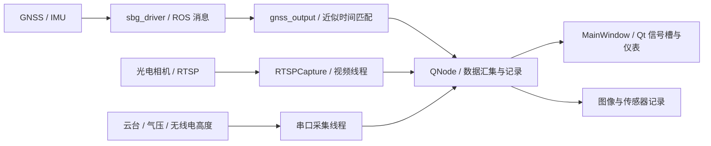

# 机载光电多源数据采集系统

面向多传感器同步采集、状态监控与数据记录的 Linux / ROS 1 / Qt 工程。这个公开版本直接整理自实际工程，保留原来的 ROS 包、Qt Designer 界面、仪表控件、串口协议处理、采集线程及保存流程。

## 系统结构

## 原工程目录

| 位置 | 保留内容 |
| --- | --- |
| [src/mainwindow](src/mainwindow) | 主窗口、配置对话框、设备接口、线程控制及采集逻辑 |
| [mainwindow.ui](src/mainwindow/src/mainwindow.ui) | 原始 Qt Designer 主界面 |
| [src/mainwindow/src/qfi](src/mainwindow/src/qfi) | 飞行仪表控件与 SVG 资源，保留原许可声明 |
| [src/mainwindow/resources](src/mainwindow/resources) | 原窗口图标、样式和 Qt 资源文件 |
| [src/sbg_ros_driver](src/sbg_ros_driver) | 集成使用的 SBG 驱动、SDK、消息、配置和启动文件 |
| [src/serial_msgs](src/serial_msgs) | 气压数据等 ROS 消息定义 |
| [config_fly.example.yaml](config_fly.example.yaml) | 从原运行配置提取的串口配置模板 |

## 主要实现

**采集与线程。** [qnode.cpp](src/mainwindow/src/qnode.cpp) 保留视频、云台、气压和无线电高度相关工作线程的启动、数据汇集及退出逻辑。[thread_control.cpp](src/mainwindow/src/thread_control.cpp) 和 [mainwindow.cpp](src/mainwindow/src/mainwindow.cpp) 展示工作对象与 Qt 界面之间的控制关系。界面更新通过信号槽衔接，耗时采集由工作线程承担。

**ROS 与时间。** [gnss_output.cpp](src/mainwindow/src/gnss_output.cpp) 使用消息过滤器匹配导航相关消息，并处理时间、单位和姿态数据。汇集层根据新图像与导航状态组织数据记录。这里的近似时间匹配、统一时间标签和设备硬件同步是不同层次；当前代码并不代表所有传感器均有共同硬件触发。

**设备与协议。** [rtsp_capture.cpp](src/mainwindow/src/rtsp_capture.cpp) 保留视频接收、缩放、红外图像处理和帧更新；[gimbal_control.cpp](src/mainwindow/src/gimbal_control.cpp)、[air_pressure.cpp](src/mainwindow/src/air_pressure.cpp)、[radio_altitude.cpp](src/mainwindow/src/radio_altitude.cpp) 保留各设备的串口通信与数据解析。

**界面与存储。** 原主窗口保留状态展示、设备配置、仪表、图像显示及记录控制。当前提交展示的是材料中保存的工程版本，部分界面字段仍为占位状态，不能据此推断所有导航或点云功能已经接入。

## 环境与入口

- 原工程使用 C++17、ROS 1 / catkin、Qt 5、OpenCV、yaml-cpp、libudev，以及 ROS serial、cv_bridge、image_transport 等依赖。
- 主构建文件为 [src/mainwindow/CMakeLists.txt](src/mainwindow/CMakeLists.txt)，包名为 `window_control`。`CMakeLists00.txt`、`CMakeLists6.txt` 是原来保存的配置版本，保留用于对照，并非同时生效。
- 在配置了相应 ROS 环境的工作空间中进行 catkin 构建；启动前按本机设备填写 `config_fly.yaml`。模板中的 `/dev/REPLACE_ME` 必须替换。
- `ACQUISITION_RTSP_URL` 提供相机地址与本机凭据；未设置时为空。`ACQUISITION_PHOTO_DIR` 提供图像输出目录，默认 `./output/Photos`。
- `ACQUISITION_GNSS_CONFIG` 可指定 GNSS 配置；默认路径以仓库根目录为工作目录解析。GUI 中启动 GNSS 的命令也按根目录下的 `devel/setup.bash` 解析。

## 公开版本说明

仅调整设备凭据、个人路径、界面中的位置示例和本地配置入口；保留算法、线程模型、消息字段、协议解析、界面布局和版本文件。运行数据、采集图像、编译输出和本地环境未上传。本次未进行设备连接、完整 ROS 编译或实测性能复验。

详见 [源码索引](docs/SOURCE_INDEX.md)、[脱敏与版本边界](docs/PUBLICATION_NOTES.md) 和 [第三方来源](THIRD_PARTY.md)。
